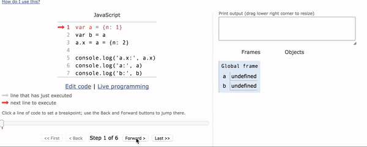

## 本周总结

- 发现了一个很好用的代码可视化工具，可以一步步地进行代码逻辑分解

  

    
  

- 以前对数据认识不足，不是一切数据都可以直接相加的(a+b)
  - 大数是什么呢？怎么进行大数相加？
  - 输出了一篇博文: [javaScript实现大数相加](http://annhuang.cn/2018/02/01/javaScript%E5%AE%9E%E7%8E%B0%E5%A4%A7%E6%95%B0%E7%9B%B8%E5%8A%A0/)

- assert断言的使用
  [官方文档](http://nodejs.cn/api/assert.html)
